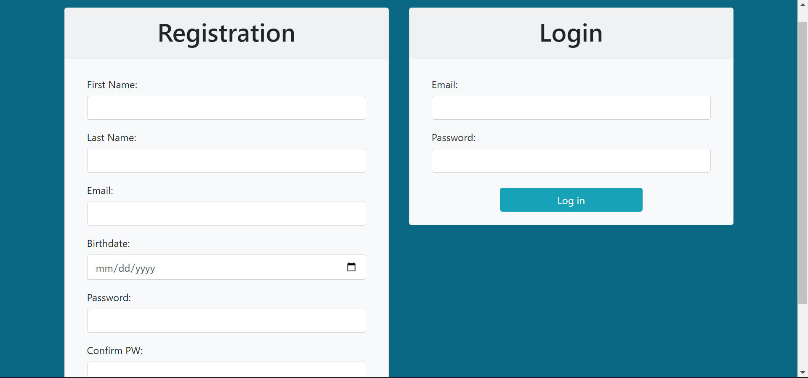
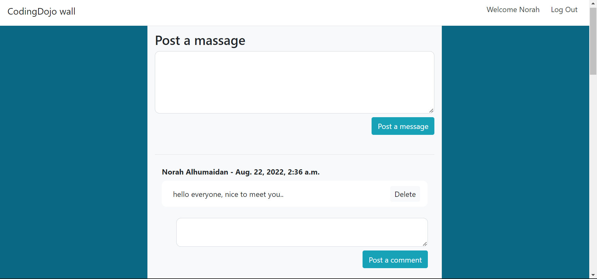
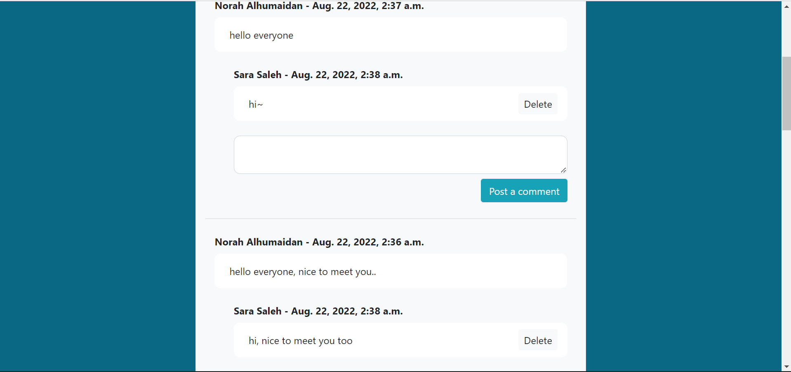
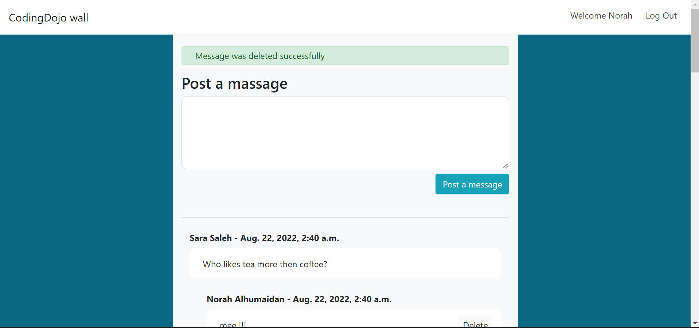
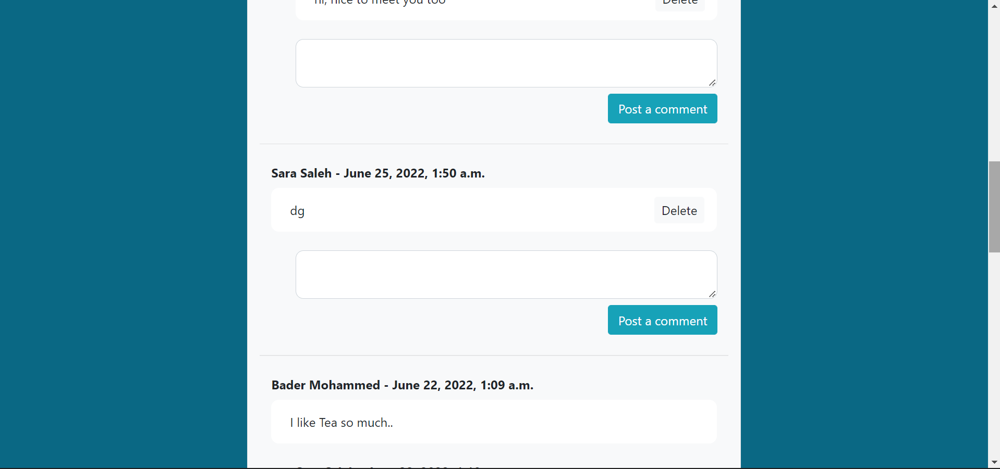
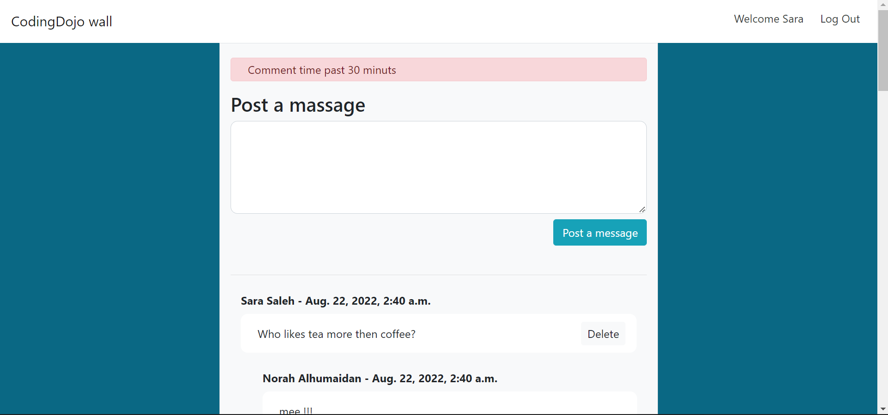

# The wall project
a django app where users will be able to post messages and see the messages posted by other users. also they can add comments to each message, can delete their messages and comments only during 30 min.
In the following we provide some images to explain the app functionality more.

### Login/Register page
   

### User Norah added a message
   

### Norah added two messages by mistake, Sara comment in both
   

### Norah deleted the second message, a successful delete msg appears
   

### Sara want to delete this message which was posted long time ago
   

### however the app dosen't allow deleting messages or comments after 30min from posting it
   

